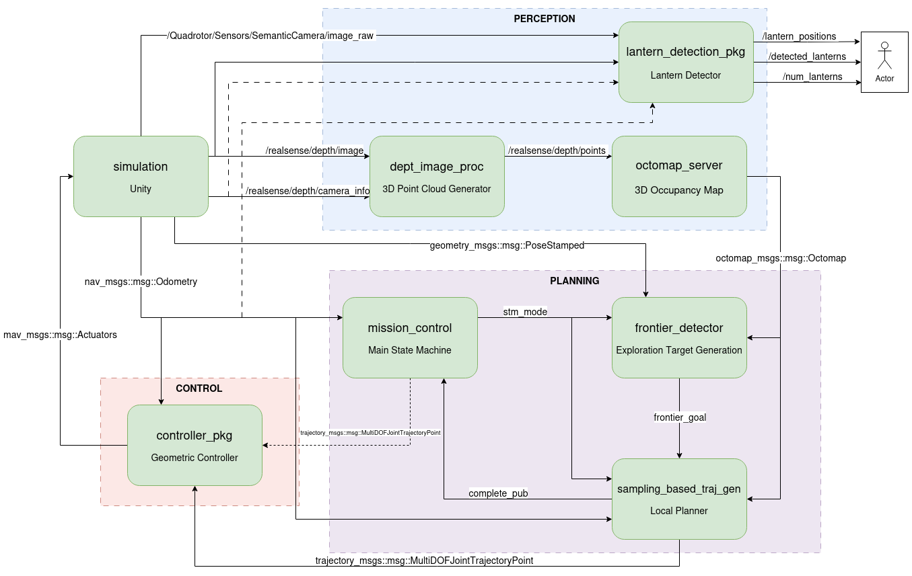
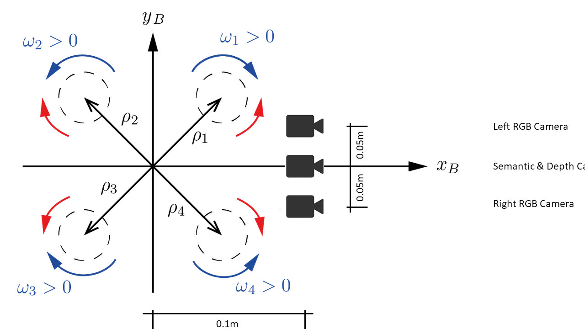

# Autonomous Cave Navigation

Autonomous exploration of a cave environment using a quadrotor UAV in a Unity-based simulation. The drone takes off, flies to the cave entrance via predefined waypoints, then autonomously explores the cave interior using frontier-based exploration and sampling-based trajectory planning while building a 3D OctoMap of the environment.

Developed as part of the **TUM Autonomous Systems 2025** course (Sub-Terrain Challenge).

## Demo Video (10x)


https://github.com/user-attachments/assets/cc8e2acb-b561-40a3-b652-1bcd92baa889


## System Architecture



**Data Flow:**
1. `simulation` provides sensor data (depth images, odometry) and forwards rotor commands to Unity
2. `octomap_server` converts depth images to point clouds and builds a 3D voxel map
3. `mission_control` orchestrates the mission phases via a state machine
4. `frontier_detector` identifies unexplored regions at the boundary of the OctoMap
5. `sampling_based_traj_gen` plans smooth, collision-free quintic polynomial trajectories to frontier goals
6. `controller` tracks the desired trajectory using geometric control on SE(3)

## Packages

| Package | Description |
|---|---|
| **`simulation`** | Unity-ROS2 bridge. Streams sensor data (depth, RGB, IMU), publishes state estimates, and sends rotor commands back to the Unity simulator. *Provided by course.* |
| **`controller_pkg`** | Geometric tracking controller based on Lee et al. Computes rotor speed commands from desired vs. current state. *Based on course template.* |
| **`octomap_mapping`** | OctoMap server that builds a 3D occupancy voxel grid from point clouds. *Third-party, with custom cave configuration.* |
| **`mission_control`** | Finite state machine managing the full mission lifecycle: Idle, Takeoff, Navigate-to-Cave (waypoint-based), Explore-Cave (autonomous), and Finished. |
| **`frontier_detector`** | Detects frontier voxels (boundaries between free and unknown space) in the OctoMap, clusters them using Mean-Shift, scores candidates, and publishes the best exploration goal. |
| **`sampling_based_traj_gen`** | Sampling-based trajectory planner. Generates multiple candidate quintic polynomial trajectories toward the goal, checks them for collisions against the OctoMap, and publishes the best one. Also serves as the trajectory executor for the navigate-to-cave phase. |
| **`lantern_detection_pkg`** | Processes semantic camera to identify lanterns in the environment, computes their 3D real-world coordinates using camera intrinsics, and tracks the total count and positions of uniquely discovered lanterns. |
| **`cave_navigation`** | Meta-package containing launch files and RViz configuration. No nodes — only orchestration. |

## Prerequisites

- **Ubuntu 24.04** (Noble Numbat)
- **ROS 2 Jazzy**
- Unity simulation binary (from course Sync&Share)

### System Dependencies

```bash
sudo apt install ros-jazzy-octomap-msgs
sudo apt install liboctomap-dev
sudo apt install  ros-jazzy-octomap
sudo apt install ros-jazzy-pcl-ros
sudo apt install ros-jazzy-pcl
sudo apt install libpcl-dev
sudo apt install  ros-jazzy-octomap-ros
sudo apt install libgflags-dev
```

## Build

```bash
cd autonomous_cave_navigation/ros2_ws

source /opt/ros/jazzy/setup.bash

colcon build --symlink-install
source install/setup.bash
```

## Run

The entire system launches with a **single command**:

```bash
ros2 launch cave_navigation integrated_mission.launch.py
```

This starts all nodes: simulation, perception, mission control, frontier detection, trajectory planning, controller, and RViz.

To launch **without RViz**:

```bash
ros2 launch cave_navigation integrated_mission.launch.py rviz:=false
```

### Launch File Structure

| Launch File | What It Starts |
|---|---|
| `integrated_mission.launch.py` | Everything (single entry point) |
| `simulation.launch.py` | Unity bridge + controller + TF publishers |
| `perception_mapping.launch.py` | Depth-to-PCL conversion + OctoMap server |
| `cave_exploration.launch.py` | Frontier detector + trajectory generator |


## Key Design Decisions

- **Frontier-based exploration**: The drone autonomously decides where to go by detecting boundaries between mapped and unmapped space — no predefined paths inside the cave.
- **Sampling-based trajectory planning**: Instead of graph-based planners, we sample multiple quintic polynomial trajectories and pick the best collision-free one. This gives smooth, dynamically feasible paths.
- **Non-zero terminal velocity**: Trajectories end at 70% of cruise speed to enable seamless chaining of consecutive segments, eliminating stop-and-go behavior.
- **Goal debouncing**: Small shifts in frontier goal position are ignored to prevent jittery replanning.
- **Configurable topics**: All ROS topic and service names are loaded from YAML, making it easy to remap or integrate with different systems.





## Team 20

| Member |
|---|
| Ali Aras Fırat |
| Oğuzhan Eşen |
| Mert Kulak |
| Emre Akçam |
| Okan Arif Güvenkaya | |

